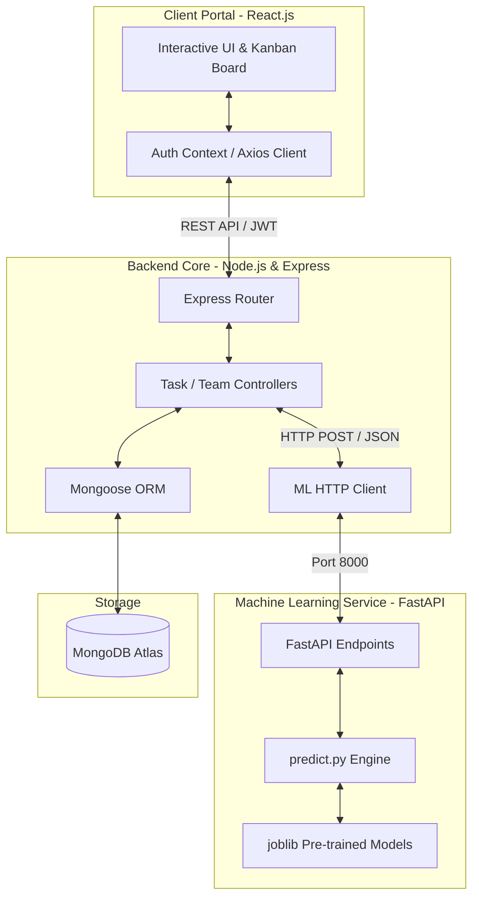

# CIPHER 2.0 — PHASE 2: TECHNICAL DOCUMENTATION
**Project Name:** CollabCore  
**Shortlist ID:** CIPHER2_CollabCore  
**Track:** Prototype & Solution Development  

---

## 1. Problem Statement

In academic and professional software engineering courses, group projects are the cornerstone of practical learning. However, traditional project collaboration frameworks suffer from several critical friction points that lead to project failure or degraded learning outcomes:

1. **Suboptimal Team Formation:** Teams are often formed arbitrarily or solely based on social circles, leading to teams with highly redundant skill sets (e.g., all designers and no developers) and highly unbalanced availability overlap.
2. **Workload Imbalances:** Without data-driven insights, tasks are distributed arbitrarily. Dominant team members end up handling the bulk of complex tasks, while others remain underutilized, causing resentment and skewed learning.
3. **Delayed Risk and Conflict Detection:** Instructors and coordinators only discover team dysfunctions, member disengagement, or interpersonal conflicts during final milestone evaluations when it is already too late to intervene.
4. **Lack of Objective Progress Metrics:** Coordination overhead is high. Mentors must manually inspect commit logs and communication channels to assess team health, which is unfeasible at scale.

---

## 2. Proposed Solution (CollabCore)

**CollabCore** is an AI-powered, collaborative team-management and project-tracking platform designed to optimize team formation, task allocation, and early risk mitigation in collaborative software development environments. 

### Core Features
- **AI-Driven Team Quality Predictor:** Evaluates team compositions during the formation phase based on availability overlap, role distribution, and technical skill diversity to preemptively classify teams as "Good" or "At Risk".
- **AI-Driven Task Suitability Ranker:** Ranks team members dynamically for newly created tasks based on technical skill compatibility, priority/urgency requirements, and current active task workloads to enforce balanced distribution.
- **Early Risk Detection & Alert System:** Monitors active engagement metrics (commit activity, milestone status, response latency) and flags teams showing signs of breakdown, triggering automatic conflict resolution cases for mentors and coordinators.
- **Kanban Board & Milestone Trackers:** A centralized portal for students to manage, assign, and discuss deliverables, connected directly to backend tracking and ML engines.

---

## 3. Core Logic & Algorithms

CollabCore integrates a modular prediction framework powered by a Python FastAPI microservice that communicates with a Node.js Express server.

### A. Team Quality Classification
The ML engine aggregates team members' profiles (skills, roles, and weekly availability) into a single feature vector representing the team:
- **Skill Diversity:** Count of unique skills with a proficiency level $\ge 2$ (Intermediate).
- **Role Coverage:** Count of covered core roles (Project Manager, Developer, Designer, QA, Business Analyst).
- **Workload Balance Score:** The standard deviation of task counts across all members:
$$\sigma = \sqrt{\frac{1}{N}\sum_{i=1}^{N}(x_i - \bar{x})^2}$$
- **Skill-Role Alignment:** Measures how well members' skills match their declared roles:
$$\text{Alignment} = \frac{1}{5}\sum_{r \in \text{Roles}} (\text{Role\_Presence}_r \times \text{Skill\_Level}_r)$$

A pre-trained **XGBoost Classifier** processes the normalized feature row to output a success probability:
- **Score:** $P(\text{Success}) \times 100$
- **Label:** `"Good"` (if $P \ge 0.5$) or `"At Risk"` (if $P < 0.5$).

### B. Task Suitability Ranking
When a task is created, the system calculates a recommendation score for each eligible team member using a multi-factor heuristic:

$$\text{Final Score} = 0.50 \cdot P(\text{Member Success}) + 0.35 \cdot \text{Skill Match Bonus} - 0.15 \cdot \text{Workload Penalty}$$

1. **Member Success Probability ($P$):** Calculated by running a 1-person pseudo-team aggregation through the classification scaler and XGBoost model.
2. **Skill Match Bonus:** Measures matching skill proficiency levels against task-required skills:
$$\text{Skill Match Bonus} = \frac{1}{|R|} \sum_{s \in R} \min\left(\frac{\text{Member\_Level}_s}{\text{Required\_Level}_s}, 1.0\right)$$
*(where $R$ is the set of required skills for the task).*
3. **Workload Penalty:** Penalizes members who are already overloaded with active tasks to prevent bottlenecking:
$$\text{Workload Penalty} = \min\left(\frac{\text{Active Tasks Count}}{10}, 0.3\right)$$

- Members with a $\text{Final Score} \ge 0.6$ are classified as **"Best Fit"** (Recommended), while others are labeled **"Available"**.

### C. Early Risk Detection
A rule-enhanced classifier analyzes team execution health by monitoring:
- **Days since last commit:** If $> 7$ days, risk probability increases by $15\%$.
- **Missed milestones:** Each missed milestone adds a cumulative $20\%$ risk penalty.
- **Average response time:** Latency $> 48$ hours adds $10\%$ risk.

---

## 4. System Architecture

CollabCore uses a decoupled microservices architecture to separate business logic, user interaction, and machine learning computation.

### Component Details:
1. **Frontend (React.js + Vanilla CSS):** Standardized UI components (Modals, Badges, Spinners) powered by a clean, responsive layout. Incorporates dynamic drag-and-drop mechanics using `@hello-pangea/dnd`.
2. **Backend (Node.js + Express):** Implements JWT-based route security, MongoDB schema validations, and formats DB collections into structured JSON payloads for the ML engine.
3. **ML Microservice (FastAPI + Scikit-Learn):** A lightweight Python service executing high-performance predictions. Models are persisted using `joblib` and loaded into memory on startup via FastAPI lifespan handlers.

---

## 5. Prototype Limitations & Future Enhancements

While the prototype successfully demonstrates end-to-end logic, several constraints exist due to the hackathon's scope:

1. **Static ML Training Data:** The models are trained on simulated synthetic data representing typical classroom compositions. In a production environment, this requires continuous online learning and feedback loops based on actual course outcomes.
2. **Self-Reported Skill Levels:** The skill matching algorithm relies on student self-assessments (Beginner, Intermediate, Advanced). Future integrations will fetch student skill metrics directly from GitHub commit languages, LeetCode progress, or past project grades.
3. **Mocked Git Analytics:** Metrics like "days since last commit" are simulated at the database level. Future scopes will implement webhooks connecting to GitHub/GitLab APIs to pull live repository metrics.
4. **Local Network Dependencies:** Node.js resolves `localhost` to IPv6 `::1` by default, which can cause connection issues with IPv4 microservices on Windows environments. The system currently bypasses this using direct IPv4 loopbacks (`127.0.0.1`).
